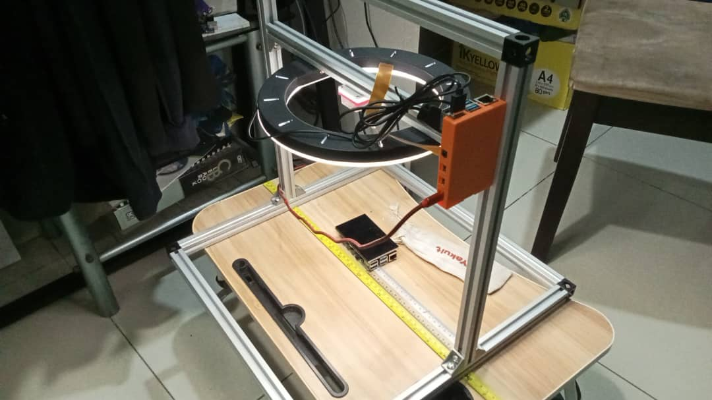

# snailCam
Just optimizing my snailCam

A shabby attempt of assembling an AI snail detection rig.

## Sensor Modes

* Distance from object is approx. is 31 cm
- Distance from floor to upper rod: 33 cm
- Camera protusion: 2 cm

 | Sensor Modes (px) | Approx Width (cm)|
 | --------------- | --------------- |
 | 1280x720  | RuntimeError: lores stream dims may not exceed main stream |  
 | 1920x1080 | 31 |
 | 2328x1748 | 38 |
 | 3840x2160 | 31 |
 | 4656x3496 | 38 |
